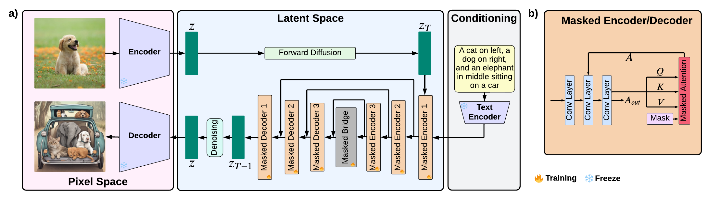

# MaskAttn-SDXL

Official implementation for the IJCNN 2026 paper:

> **MaskAttn-SDXL: Controllable Region-Level Text-to-Image Generation**  
> Yu Chang, Jiahao Chen, Anzhe Cheng, and Paul Bogdan

Paper: [arXiv:2509.15357](https://arxiv.org/abs/2509.15357)



## Overview

MaskAttn-SDXL introduces token-conditioned spatial masks into SDXL cross-attention. A lightweight gate predicts a spatial mask for each text token and injects its additive mask into the cross-attention logits before softmax. The SDXL U-Net, VAE, text encoders, and sampling pipeline remain frozen; only the masking heads are trained.

## Features

- Token-conditioned spatial gating in SDXL cross-attention.
- Hard masks with sigmoid, threshold `0.5`, and straight-through estimation.
- Configurable high/mid/low/all-stage gating and encoder/decoder/full placement.
- COCO data preparation, training, quality evaluation, compositional benchmark adapters, efficiency benchmarking, ablations, and qualitative generation.
- Token-wise mask and attention visualisation.

## Repository structure

```text
MaskAttn-SDXL/
├── configs/
│   ├── train_512.yaml                 512×512 training configuration
│   ├── train_1024.yaml                1024×1024 training configuration
│   ├── eval_quality.yaml              COCO / Flickr30k quality evaluation
│   ├── eval_compositional.yaml        T2I-CompBench++ / GenEval adapter configuration
│   ├── efficiency.yaml                SDXL / MaskAttn-SDXL efficiency benchmark
│   ├── baselines.yaml                 baseline generation settings
│   └── generate_qualitative.yaml      fixed-prompt qualitative generation
├── docs/
│   ├── assets/maskattn-sdxl-architecture.png
│   ├── BENCHMARKS.md                  official evaluator and benchmark setup
│   └── RELEASE_CHECKLIST.md           release-readiness checklist
├── experiments/
│   ├── train_maskattn_sdxl.py         gate-head training
│   ├── eval_quality.py                FID / CLIP Score / Precision / Recall
│   ├── eval_compositional.py          T2I-CompBench++ and GenEval adapter
│   ├── benchmark_efficiency.py        parameters, memory, and latency
│   ├── ablate_gating_stage.py         high / mid / low / all stage ablation
│   ├── ablate_module_placement.py     encoder / decoder / full placement ablation
│   ├── generate_baseline.py           unified baseline image generation
│   ├── generate_qualitative.py        qualitative comparison and mask export
│   └── run_all.py                     configurable experiment launcher
├── scripts/
│   ├── prepare_coco_captions.py       COCO multi-noun caption cache builder
│   ├── prepare_baselines.py           baseline model preparation helper
│   ├── prepare_benchmarks.py          external benchmark preparation helper
│   ├── smoke_sdxl.py                  minimal baseline SDXL pipeline check
│   └── smoke_maskattn_sdxl.py         minimal MaskAttn-SDXL integration check
├── src/maskattn_sdxl/
│   ├── gating.py                      token-conditioned spatial gate and STE
│   ├── processor.py                   Diffusers cross-attention processor
│   ├── model.py                       SDXL U-Net installation and checkpoints
│   ├── runtime.py                     checked MaskAttn-SDXL pipeline loader
│   ├── generation.py                  shared generation utilities
│   ├── training.py                    frozen-backbone training utilities
│   ├── data.py                        COCO caption data utilities
│   ├── metrics.py                     quality metric wrappers
│   ├── benchmarks.py                  external evaluator adapters
│   ├── visualize.py                   token mask / attention visualisation
│   └── config.py                      YAML and CLI configuration utilities
├── tests/                             unit and Diffusers integration tests
├── EXPERIMENT_MATRIX.md               paper table/figure → script/config/output map
├── REPRODUCIBILITY.md                 implementation assumptions and protocol
├── MASKATTN_RUNTIME_AUDIT.md          runtime validation record
├── CITATION.cff                       machine-readable citation metadata
├── pyproject.toml                     package and dependency definitions
└── requirements.txt                   pip requirements
```

Generated models, datasets, checkpoints, caches, and `outputs/` are ignored by Git.

## Installation

Python 3.10+ and PyTorch 2.4+ are required.

```bash
git clone https://github.com/ychang64/MaskAttn-SDXL.git
cd MaskAttn-SDXL

python -m venv .venv
source .venv/bin/activate
python -m pip install --upgrade pip
python -m pip install -e '.[dev]'
```

Install optional dependencies as needed:

```bash
# COCO noun-phrase filtering
python -m pip install -e '.[data]'
python -m spacy download en_core_web_sm

# FID, CLIP Score, Precision, and Recall
python -m pip install -e '.[metrics]'
```

Core dependencies are pinned in [pyproject.toml](pyproject.toml): PyTorch, Diffusers 0.35.1, Transformers, Accelerate, Safetensors, Hugging Face Hub, Datasets, Pillow, NumPy, PyYAML, and tqdm.

## Model weights

By default, the repository uses a local SDXL Base checkpoint at:

```text
models/stable-diffusion-xl-base-1.0/
```

Download the checkpoint after accepting the upstream model license:

```bash
huggingface-cli download stabilityai/stable-diffusion-xl-base-1.0 \
  --local-dir models/stable-diffusion-xl-base-1.0
```

You can also use a Hugging Face model ID explicitly:

```bash
python experiments/generate_qualitative.py --config configs/generate_qualitative.yaml \
  --set model.path=stabilityai/stable-diffusion-xl-base-1.0 \
  --set model.allow_download=true
```

The implementation and experiment scripts are provided, but pretrained MaskAttn gate weights are not currently included. Train gates with the training entry point below, then pass the resulting `gate_final.pt` through `--checkpoint` or `--set checkpoint=...` for MaskAttn inference, evaluation, and benchmarking.

## Quick start

```bash
# Check installation without data or weights
python experiments/train_maskattn_sdxl.py --smoke-test
python -m pytest -q

# Generate one baseline SDXL smoke image
python scripts/smoke_sdxl.py --model models/stable-diffusion-xl-base-1.0

# Explicit untrained MaskAttn wiring smoke; this is not a trained model
python scripts/smoke_maskattn_sdxl.py --model models/stable-diffusion-xl-base-1.0 \
  --allow-untrained-gates

# Run trained MaskAttn-SDXL inference after training gate weights
python scripts/smoke_maskattn_sdxl.py --model models/stable-diffusion-xl-base-1.0 \
  --checkpoint outputs/train_1024/checkpoints/gate_final.pt

# Generate qualitative samples and token masks
python experiments/generate_qualitative.py --config configs/generate_qualitative.yaml \
  --set checkpoint=outputs/train_1024/checkpoints/gate_final.pt
```

Experiment entries support `--help`, `--config`, `--set key=value`, `--dry-run`, and `--smoke-test`. The two standalone smoke scripts support `--help` and `--dry-run`.

## Data preparation

```bash
python scripts/prepare_coco_captions.py \
  --annotations /path/to/coco/annotations/captions_train2014.json \
  --images-dir /path/to/coco/train2014 \
  --output data/coco_train2014_multi_noun.jsonl \
  --min-noun-phrases 2 \
  --limit 200000
```

## Training

```bash
# 512x512 phase: 100k steps, effective batch size 16
accelerate launch experiments/train_maskattn_sdxl.py --config configs/train_512.yaml

# 1024x1024 phase: 10k steps, batch size 8
accelerate launch experiments/train_maskattn_sdxl.py --config configs/train_1024.yaml \
  --set train.resume_from=outputs/train_512/checkpoints/gate_final.pt
```

## Evaluation and ablations

```bash
# COCO / Flickr30k quality evaluation with trained gate weights
python experiments/eval_quality.py --config configs/eval_quality.yaml \
  --set checkpoint=/path/to/gate_final.pt

# T2I-CompBench++ / GenEval official evaluator adapter
python experiments/eval_compositional.py --config configs/eval_compositional.yaml \
  --evaluator-command 'python /path/to/official_evaluator.py --images {images} --prompts {prompts} --output {output}'

# Parameter count, CUDA memory, and latency
python experiments/benchmark_efficiency.py --config configs/efficiency.yaml \
  --set checkpoint=/path/to/gate_final.pt

# Stage and module-placement ablations
accelerate launch experiments/ablate_gating_stage.py --config configs/train_512.yaml --stages high mid low all
accelerate launch experiments/ablate_module_placement.py --config configs/train_512.yaml --placements encoder decoder encoder_decoder

# Baseline generation
python experiments/generate_baseline.py --config configs/baselines.yaml --baseline sdxl
```

See [EXPERIMENT_MATRIX.md](EXPERIMENT_MATRIX.md) for the complete mapping from paper experiments to scripts, configs, data, metrics, and outputs. See [REPRODUCIBILITY.md](REPRODUCIBILITY.md) for implementation details and [docs/BENCHMARKS.md](docs/BENCHMARKS.md) for external evaluator setup.

## License

This repository is released under the [Apache-2.0 License](LICENSE). Please also review the licenses for SDXL, Diffusers, COCO, Flickr30k, T2I-CompBench++, GenEval, and the baseline methods before use or redistribution.

## Citation

If you use this repository in your research, please cite:

```bibtex
@inproceedings{chang2026maskattn_sdxl,
  title     = {MaskAttn-SDXL: Controllable Region-Level Text-to-Image Generation},
  author    = {Chang, Yu and Chen, Jiahao and Cheng, Anzhe and Bogdan, Paul},
  booktitle = {International Joint Conference on Neural Networks (IJCNN)},
  year      = {2026},
  url       = {https://arxiv.org/abs/2509.15357}
}
```

Machine-readable metadata is available in [CITATION.cff](CITATION.cff).
